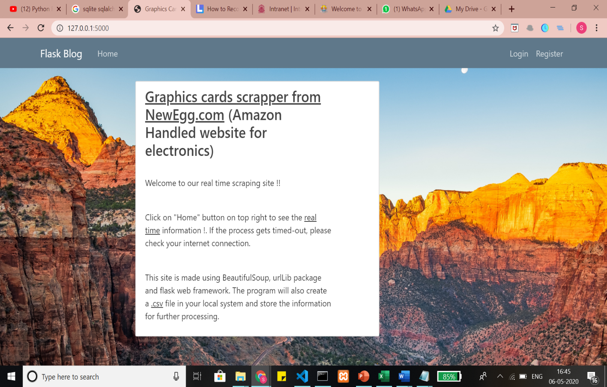
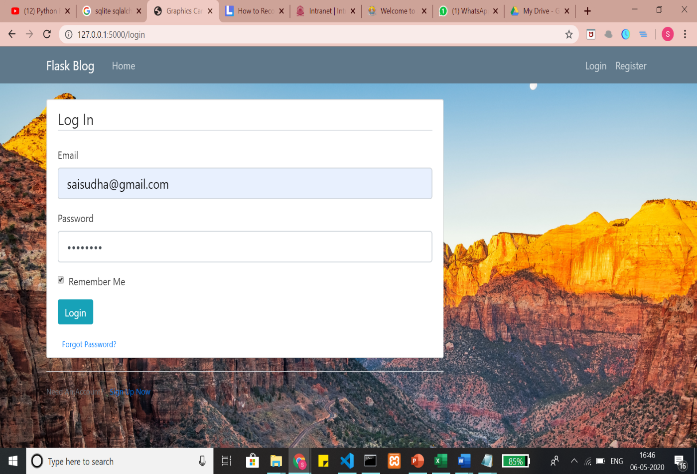
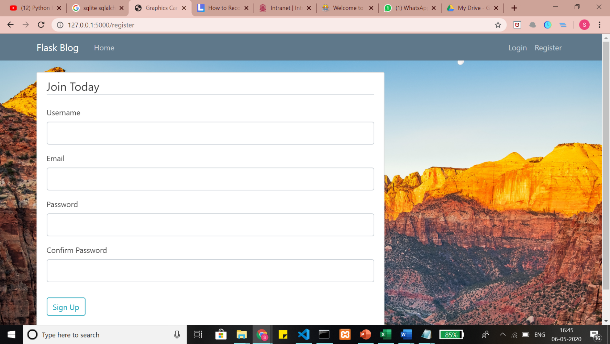
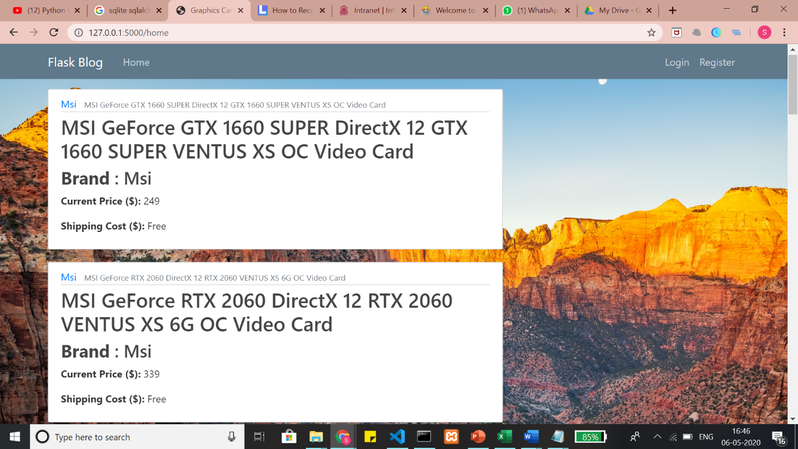
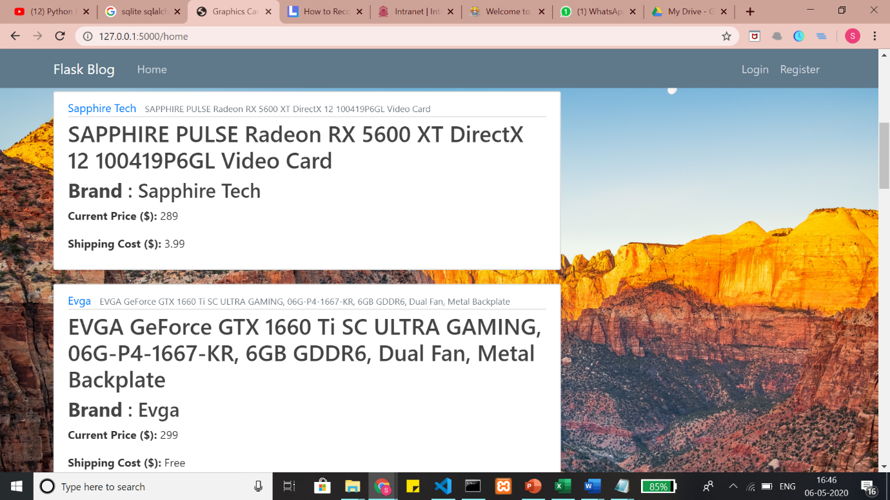
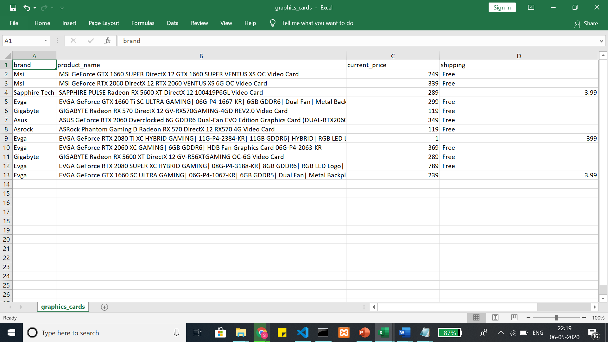

# [Graphics Cards Scrapper]{.underline}

This flask app acts as a Graphics cards scrapper from
[NewEgg.com]{.underline} (Amazon Handled website for electronics) and
scrapes information about the products such as brand, shipping cost,
total cost etc. The site is made using BeautifulSoup, urlLib package and
flask web framework. The project will also create
a [.csv]{.underline} file in your local system and store the information
for further processing.

[How to run the project]{.underline}: -

1.  Open Terminal and set the project folder (with four files/folders)
    as current directory.

2.  Run the command "python run.py".

3.  The Homepage of the app is shown in your Browser.

4.  SQLite has to be downloaded and a database of the name "USER" has to
    be created with email id, name and password as attributes.

5.  A CSV. File will be automatically created to save the extracted
    contents.

[Screenshots]{.underline}

[Home page]{.underline}

This page contains introduction about the project and gives the options
for register, login and home buttons.

This is the default route(/)

{width="8.20486111111111in"
height="5.307478127734033in"}

[Login page]{.underline}

The user can login only if the user data is already stored in the SQLite
database. This happens when a user register. After registration process,
the user can visit this screen and enter the login credentials.

Input validations and checking with the database for the values is also
done here.

With the use of cookies, a user can be automatically login even after
closing the browser. This can be done with the 'remember me' button.

This is the (/login) route.

{width="8.145833333333334in"
height="5.0in"}

[\
Register page]{.underline}

The registration page is for new users to register.

Entries to the database is done here.

{width="8.184027777777779in"
height="4.167361111111111in"}After signing up, the user is automatically
redirected to the login page.

This is the (/register) route.\
{width="8.097222222222221in"
height="4.175in"}[Product Display in real time]{.underline}

{width="8.080897856517936in"
height="4.090277777777778in"}Information such as product name, product
brand, current price and shipping price is scrapped from the html
elements and displayed here in a grid.

[.CSV file]{.underline}

{width="8.215331364829396in"
height="4.366666666666666in"}After extraction, the details are stored in
a .csv file in same folder of local machine.

